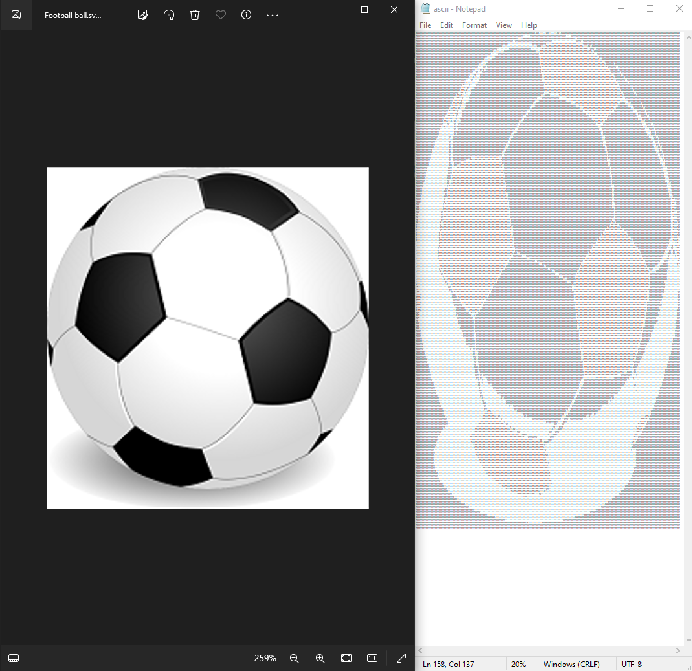

# ascii-art-convertor
Small python program to convert images to ascii art.



## How to use

* Download this repo.
* Running your terminal in the folder of the repo, execute the program like this:
```
python main.py your_image_path amount_of_colors_to_consider
```
For example, you could do:
```
python main.py ./images\"Football ball.png" 3
```
And you will get a .txt file with ascii art of the selected image, reducing the amount of colors it has to 3.

## How does it work

The program takes the image you choose and reduce the amount of colors it has to the amount specified when executing it. This is done using an algorithm called [k-means clustering](https://en.wikipedia.org/wiki/K-means_clustering) that is applied with the help of a library called [OpenCV](https://docs.opencv.org/3.4/index.html) for manipulating images, among other things. After that, each color is assigned an ascii character, and then the .txt file is created.

## Disclaimer

The code works best when the images are small and not very complex, though fell free to try varying the amount of colors in the converted image to get different results. Also, as characters in most text processing programs tend to be taller than they are wide, converted images will vary their size in comparison with the original image.
Many improvements can be made to this code, including enhancing the selection of characters per color (it would be better to choose "more filled" characters for darker colors) and finding a way for images to not change their original size too much. I can not promise this changes will be added as I did this mostly because I was bored and had the time to do so, but feel free to do so yourself if you feel like it.
